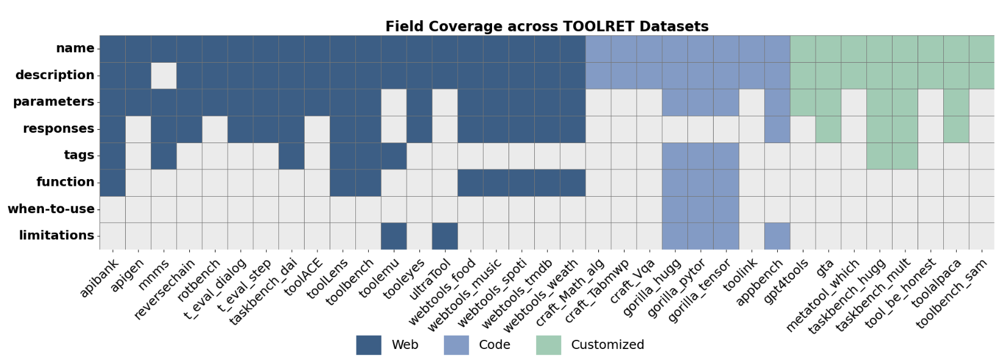

# Tool-REX

<p align="center">
  <a href="https://arxiv.org/abs/2510.22670"></a>
  <a href="https://opensource.org/licenses/Apache-2.0"></a>
  <a href="https://huggingface.co/collections/Lux1997/tool-rex"></a>
</p>

Tool-REX (Tool Retrieval with EXpansion) is a benchmark and framework that enhances tool retrieval by systematically enriching tool documentation using Large Language Models (LLMs).

---

## 📖 Introduction

Tool-REX is a new benchmark and framework that enhances tool retrieval by systematically enriching tool documentation using Large Language Models (LLMs).
Existing benchmarks (e.g., ToolBench, ToolACE, ToolRet) reveal a key bottleneck — incomplete and inconsistent tool documentation hinders retrieval quality.

<div align="center">
  
  <p><em>Figure 1: Incomplete field coverage across the 35 tool-use datasets.</em></p>
</div>

To address this, Tool-REX introduces an LLM-driven document expansion pipeline that generates structured fields such as `function_description`, `when_to_use`, `limitations`, and `tags`.
We further release two models built upon this data:

- **Tool-Embed** – a dense retriever trained on **50k** expanded documents  
- **Tool-Rank** – an LLM-based reranker trained on **200k** pairs  

Tool-REX achieves new state-of-the-art results on both ToolRet and its own benchmark, setting a foundation for data-centric tool retrieval research.

---

## 🔗 Resources

### Datasets 
**Benchmark**
- [Tool-REX-Tools](https://huggingface.co/datasets/Lux1997/Tool-REX-Tools)
- [Tool-REX-Queries](https://huggingface.co/datasets/Lux1997/Tool-REX-Queries)

**Training Datasets**

- [Tool-REX_train_retriever_50k](https://huggingface.co/datasets/Lux1997/Tool-REX_train_retriever_50k)
- [Tool-REX_train_reranker_200k](https://huggingface.co/datasets/Lux1997/Tool-REX_train_reranker_200k)

### Models 
**Tool-Embed**
- [Tool-Embed-0.6B](https://huggingface.co/Lux1997/Tool-Embed-0.6B)
- [Tool-Embed-4B](https://huggingface.co/Lux1997/Tool-Embed-4B)

**Tool-Rank**
- [Tool-Rank-4B](https://huggingface.co/Lux1997/Tool-Rank-4B)
- [Tool-Rank-8B](https://huggingface.co/Lux1997/Tool-Rank-8B)

---

## 🧩 Environment
Tested with Python 3.10+ and CUDA-enabled GPUs for large models.

Install dependencies:
```bash
conda env create -f requirements.yml
conda activate tool-rex
```

## 🚀 Quickstart
All examples assume you are in the repository root.

### 1) Retrieval (dense retriever)
Use `eval_retrieval` in `tool_de/eval.py` or run the example script.
```bash
python example/embedding.py
```

Direct call:
```python
from tool_de.eval import eval_retrieval

results = eval_retrieval(
    model_name="Lux1997/Tool-Embed-0.6B",
    tasks="all",
    category="all",
    batch_size=8,
    output_file="./results/output_embed_0.6b.json",
    top_k=100,
    is_inst=False,
    is_print=True
)
```

### 2) Reranking (ToolRank / reranker)
ToolRank uses `eval_toolrank` in `tool_de/eval.py`.
```bash
python example/rerank_single_task.py
```

Direct call:
```python
from tool_de.eval import eval_toolrank

output, results = eval_toolrank(
    model_name="Lux1997/Tool-Rank-4B",
    tasks="all",
    instruct=True,
    from_top_k=100,
    batch_size=4,
    context_size=32000,
    num_gpus=1,
    force_rethink=0,
    retrieval_results_path="./results/output/your_retrieval_output.json"
)
```

## 🔁 How to switch models
You can change models in two ways:

1) Pass a different `model_name` at runtime:
```python
eval_retrieval(model_name="Lux1997/Tool-Embed-4B", ...)
eval_toolrank(model_name="Lux1997/Tool-Rank-8B", ...)
```

2) Update defaults in `tool_de/config.py`:
- `_EMBEDDING_MODEL`
- `_RERANKING_MODEL`
- `_QUERY_REPO` / `_TOOL_REPO`

## 📝 Notes
- Reranking requires retrieval outputs first. Provide the retrieval output path via `retrieval_results_path`.
- Datasets are loaded from Hugging Face via the dataset IDs in `tool_de/config.py`.

## 📚 Citation
```bibtex
@misc{lu2025tool-rex,
      title={Tools are under-documented: Simple Document Expansion Boosts Tool Retrieval},
      author={Xuan Lu and Haohang Huang and Rui Meng and Yaohui Jin and Wenjun Zeng and Xiaoyu Shen},
      year={2025},
      eprint={2510.22670},
      archivePrefix={arXiv},
      primaryClass={cs.IR},
      url={https://arxiv.org/abs/2510.22670},
}
```

## Credits

Part of the code is adapted from [tool-retrieval-benchmark](https://github.com/mangopy/tool-retrieval-benchmark).

